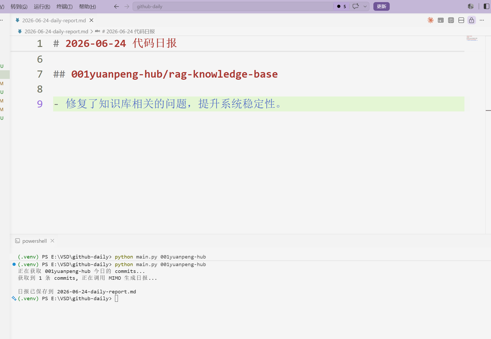

# Daily Reporter (GitHub 日报生成器)

一个基于 Python 的命令行工具（CLI），能够自动获取指定 GitHub 用户当天的 Commit 提交记录，并利用 AI 大模型智能生成结构清晰、排版美观的技术代码日报。

---

## 🚀 功能特点

* **自动化数据采集**：直接调用 GitHub REST API，精准提取用户的仓库名、Commit 消息和提交时间。
* **AI 智能摘要**：支持 Mimo / Claude 双引擎，对凌乱的 Commit 记录进行去粗取精，自动归纳今日工作亮点。
* **标准 Markdown 输出**：自动生成以日期命名的 `.md` 日报文件，方便复制和存档。

## 🛠️ 技术栈

* **语言**：Python 3.10+
* **网络请求**：HTTPX (用于调用 GitHub API)
* **大模型对接**：Mimo AI / Anthropic Claude API（可选）
* **配置管理**：Python-dotenv (环境保护，拒绝密钥泄露)

## 📦 快速开始

### 1. 克隆与配置
首先克隆本项目到本地，并在项目根目录下创建一个 `.env` 文件，填入你的密钥：

```env
GITHUB_TOKEN=your_github_personal_access_token
ANTHROPIC_API_KEY=your_api_key
```

### 2. 安装依赖
```bash
pip install -r requirements.txt
```

### 3. 运行
```bash
# 使用 Mimo API（默认）
python main.py <github_username>

# 明确指定使用 Mimo
python main.py <github_username> --mimo

# 使用 Claude API
python main.py <github_username> --claude
```

例如：
```bash
python main.py 001yuanpeng-hub
python main.py 001yuanpeng-hub --mimo
python main.py 001yuanpeng-hub --claude
```

运行成功后会在当前目录生成 `YYYY-MM-DD-daily-report.md` 文件。

---

## 📸 效果演示


